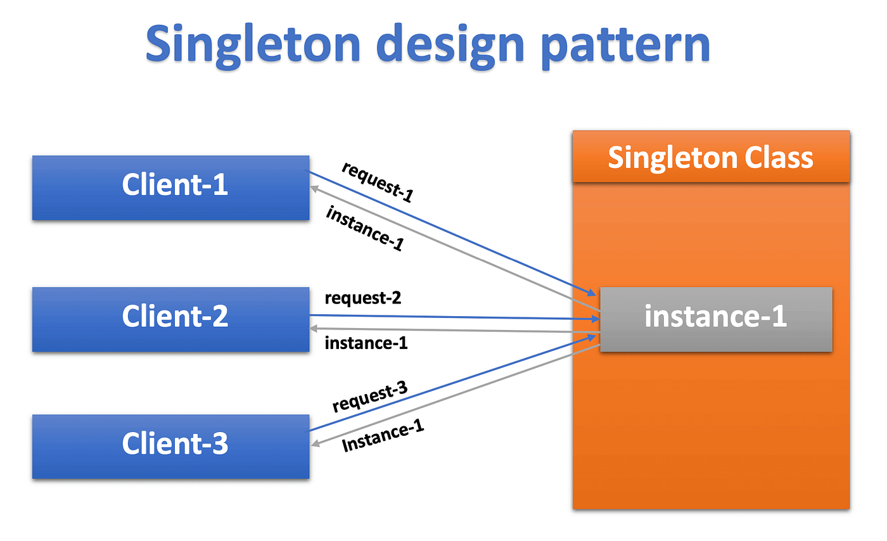

# 🧩 Le Patron de Conception Singleton

## Définition
Le **Singleton** est un patron de conception (**design pattern**) qui garantit la création d’une **seule instance** d’une classe dans une application.  

Il est principalement utilisé pour **contrôler l’accès à une ressource partagée**, comme :
- une **base de données**  
- un **fichier de configuration**  
- un **service global** (logger, gestionnaire d’état, etc.)

>[!IMPORTANT]  
L’idée centrale du Singleton est de s’assurer qu’il n’y ait **qu’une seule instance** d’une classe, même si elle est appelée plusieurs fois dans le code.  

---

## Comment ça fonctionne ?
- Le Singleton **stocke l’instance** de la classe créée la première fois.  
- Les appels suivants réutilisent **exactement la même instance**.  
- Cela permet d’éviter la création d’objets supplémentaires qui pourraient entraîner :
  - des **problèmes de performance**  
  - des **incohérences de données**  

[!NOTE]  
Le Singleton peut être implémenté de plusieurs façons, mais la méthode la plus courante est :
1. Une **propriété statique privée** qui stocke l’instance unique.  
2. Une **méthode publique statique** qui retourne l’instance :  
   - Si l’instance n’existe pas → elle est créée.  
   - Sinon → on retourne l’instance déjà existante.  

---

## Exemple d’utilisation
Un cas très fréquent est la **gestion de connexion à une base de données**.  
Il est essentiel d’avoir **une seule connexion ouverte** pour :  
- éviter les conflits de données  
- améliorer les performances  

En utilisant un Singleton, les développeurs s’assurent qu’il n’existe qu’une seule connexion active à la fois.  

---

## Inconvénients
Bien que pratique, le Singleton a aussi des **limitations** :  

[!CAUTION]  
- Il rend le code **plus difficile à tester et maintenir**, car l’instance unique est partagée partout.  
- Il limite l’**héritage** : il n’est pas possible de créer des sous-classes avec des instances différentes.  

---

## ✅ Résumé
- **Avantage :** contrôle centralisé d’une ressource partagée (ex. base de données, configuration).  
- **Inconvénient :** rigidité (tests, héritage, maintenance).  
- **À retenir :** le Singleton doit être utilisé avec **précaution** et uniquement lorsque l’unicité d’une instance est réellement nécessaire.  

